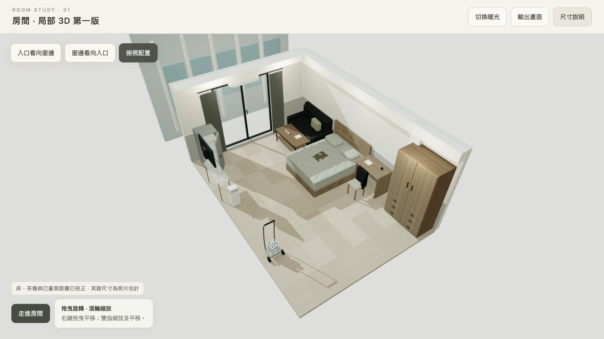

# 我的房間 · 3D 第一版

以 Three.js、TSL 與 WebGL2 製作的可互動房間模型，可旋轉、縮放及第一人稱走動。

**[直接進入 3D 房間 →](https://rolanthhuang.github.io/my_room/)**



## 操作

- 拖曳旋轉，滾輪縮放；右鍵拖曳平移。
- 按「走進房間」後，拖曳轉頭，使用 WASD、方向鍵或畫面方向按鈕移動。
- Esc 返回旋轉觀看；家具與牆面設有移動碰撞範圍。
- 可切換入口、窗邊及俯視位置，調整亮度與日光／暖光。
- 「輸出畫面」可產生目前的 3D 畫面 PNG。

## 已量測的比例

| 項目 | 尺寸 |
| --- | --- |
| 床墊長 × 寬 | 188 × 152 cm |
| 床墊厚度 | 34 cm |
| 床基座高度 | 25 cm |
| 床面總高 | 59 cm |
| 窗框到最近床邊 | 195 cm |
| 窗框到浴室門方向 | 618 cm |
| 茶幾長 × 寬 | 120 × 60 cm |

入口位於電視側牆、靠浴室端。模型只有一台冰箱，旁邊較小的形狀是開啟的門板。

房間寬度、天花板高度、沙發與其他未量測家具尺寸仍依照片估計。這是空間及動線測試的第一版，浴室以門作為模型邊界。

分享版只包含 3D 模型、尺寸與操作功能，沒有內嵌原始房間照片。

## 本機觀看與修改

`index.html` 已將程式和程序產生的材質打包在同一個檔案，執行時不依賴外部 CDN。

使用本機預覽伺服器：

```sh
python3 -m http.server 8080 --bind 127.0.0.1
```

然後開啟 `http://127.0.0.1:8080/`。

修改來源後重新打包：

```sh
npm ci --ignore-scripts
npm run build
```

來源位於 `src/room.js` 與 `src/template.html`，套件版本已固定。模型以公尺為單位。

## 渲染與授權

使用 Three.js 0.180.0 的 `WebGPURenderer({ forceWebGL: true })` 與 TSL node materials，實際渲染後端為 WebGL2。

Three.js 的 MIT 授權保存在 [licenses/three-MIT.txt](licenses/three-MIT.txt)，也包含於打包檔案中。
